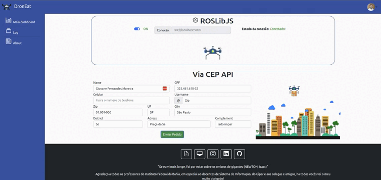

# Interface Dronelivery

       

<center>
  
</center>

> Esta implementação une os recurso de uma API com uma biblioteca para dar suporte a entregas delivery por meio de drones

### Ajustes e melhorias

O projeto ainda está em desenvolvimento e as próximas atualizações serão voltadas nas seguintes tarefas:

- [X] Desenvolver a base do código
- [ ] Desenvolver sistema de login
- [X] Desenvolver dashboard com as conexões com API, bibliotecas e serviços
- [X] Desenvolver front-end do sistema de log
- [ ] Desenvolver back-end do sistema de log
- [ ] Desenvolver pagina de about

## 💻 Pré-requisitos

Para executar este projeto, bem como sua simulação é necessario ter Ubuntu 20.04 LTS, ROS Noetic e algum servidor local.

<!--Antes de começar, verifique se você atendeu aos seguintes requisitos:
-Estes são apenas requisitos de exemplo. Adicionar, duplicar ou remover conforme necessário--->

<!---* Você instalou a versão mais recente de `<linguagem / dependência / requeridos>`
* Você tem uma máquina `<Windows / Linux / Mac>`. Indique qual sistema operacional é compatível / não compatível.
* Você leu `<guia / link / documentação_relacionada_ao_projeto>`.--->

<!---## ☕ Instalando Geekflix

Para instalar o Geekflix, siga estas etapas:

Linux e macOS:
```
<comando_de_instalação>
```

Windows:
```
<comando_de_instalação>
```
--->

## 🚀 Utilizando o Dronelivery

Atualmente o projeto inicial se encontra operativo em sua fase beta, para utliza-lo iremos usar a localhost.

Para utilizar o Dronelivery, basta acessar a seguinte url:

https://giovane-f-moreira.github.io/Dronelivery/

Ao entrar no sistema você terá que conectar ao ROS para conseguir utilizar o serviço, a home page terá explicações de modo de uso.

<!---
```
<exemplo_de_uso>
```

Adicione comandos de execução e exemplos que você acha que os usuários acharão úteis. Fornece uma referência de opções para pontos de bônus!
--->

## 📫 Contribuindo para Dronelivery

<!---Se o seu README for longo ou se você tiver algum processo ou etapas específicas que deseja que os contribuidores sigam, considere a criação de um arquivo CONTRIBUTING.md separado--->

Para contribuir com Dronelivery, siga estas etapas:

1. Bifurque este repositório.
2. Crie um branch: `git checkout -b <nome_branch>`.
3. Faça suas alterações e confirme-as: `git commit -m '<mensagem_commit>'`
4. Envie para o branch original: `git push origin <nome_do_projeto> / <local>`
5. Crie a solicitação de pull.

Como alternativa, consulte a documentação do GitHub em [como criar uma solicitação pull](https://help.github.com/en/github/collaborating-with-issues-and-pull-requests/creating-a-pull-request).

## 🤝 Colaboradores

<table>
  <tr>
    <td align="center">
      <a href="#">
        <br>
        <sub>
          <b>Giovane Fernandes</b>
        </sub>
        </hr>
      </a>
    </td>
  </tr>
  <tr>
    <td>
      <sub>
        <b>Criador do Projeto</b>
      </sub>
    </td>
  </tr>
</table>

## 😄 Seja um dos contribuidores

Quer fazer parte desse projeto? Clique [AQUI](CONTRIBUTING.md) e leia como contribuir.

## 📝 Licença

Esse projeto está sob licença. Veja o arquivo [LICENÇA](LICENSE.md) para mais detalhes.

[⬆ Voltar ao topo](#nome-do-projeto)
